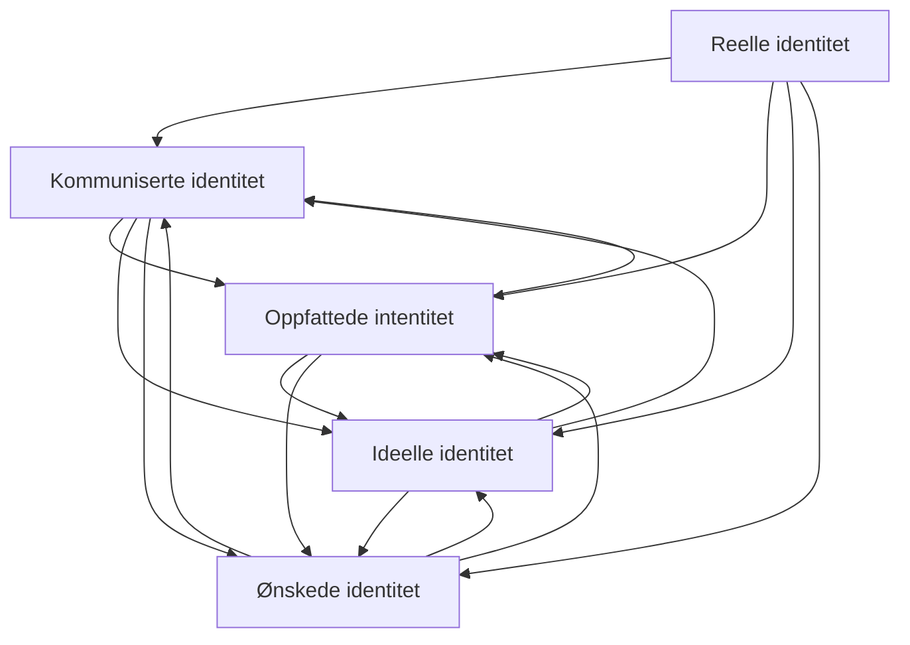

1. Virksomhetense reelle identitet (hva virksomheten er)
2. Virksomhetens kommuniserte identitet (hva vi sier om oss selv)
3. Virksomhetens oppfattede identitet
4. Virksomhetens ideelle identitet
5. Ønskede identitet

