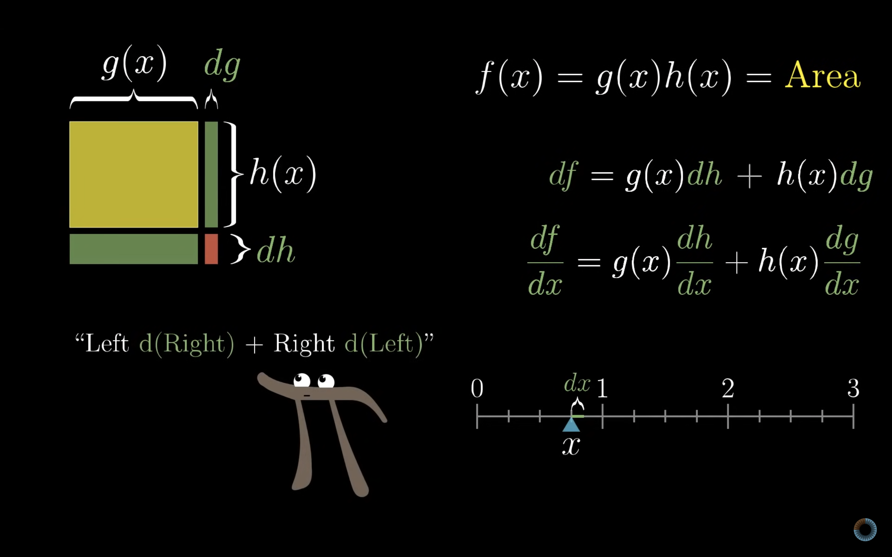
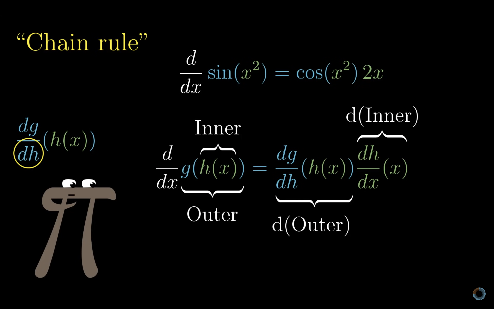
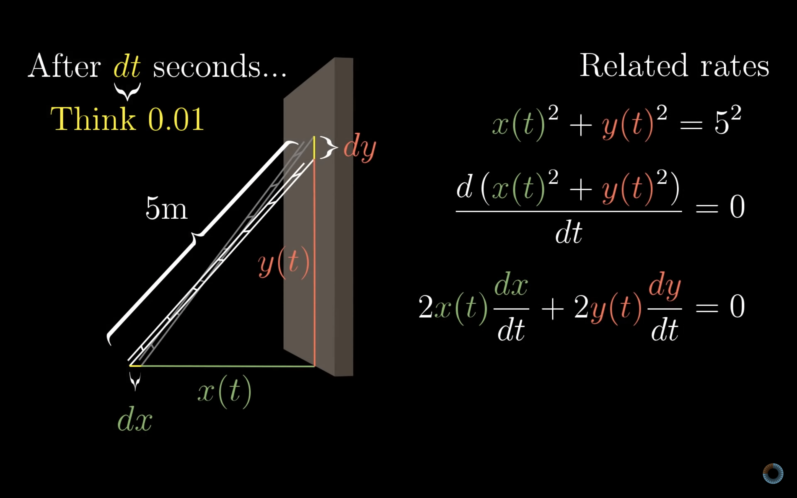

## Learn deratives intuitively with these videos

- [The Essence of Calculus](https://youtu.be/WUvTyaaNkzM?si=IQIk0RrW4BaT18su)
- [The paradox of the derivative](https://youtu.be/9vKqVkMQHKk?si=pyi2oBCsh3Fw5Aqe)
- [Derivative formulas through geometry](https://youtu.be/S0_qX4VJhMQ?si=aG4Q66sPXXs9UlwT)
- [Visualizing the chain rule and product rule](https://youtu.be/YG15m2VwSjA?si=TaS7YjNxGamvT6zA)
- [What's so special about Euler's number e?](https://youtu.be/m2MIpDrF7Es?si=O-upyhTb_ZEhPAvS)
- [Implicit differentiation](https://youtu.be/qb40J4N1fa4?si=qhDjC90W3VWhe8ki)

## Sum, product and composition

### Sum rule

$$
{d \over dx}(g(x) + h(x)) = {dg \over dx} + {dh \over dx}
$$

$$
f'(g(x) + h(x)) = g'(x) + h'(x)
$$

### Product rule

### Chain rule

## Exponents and Euler's number

$$
{dX \over dt} f(x)

$$
$$

\lim_{dt \to 0}
$$

## Implicit differentiation

Suppose you have a set of points defined by the expression $x^2 + y^2 = 5^2$. This set of points forms a circle. How do you take the derivative of a point of that range? $x^2 + y^2 = 5^2$ is not a function.

