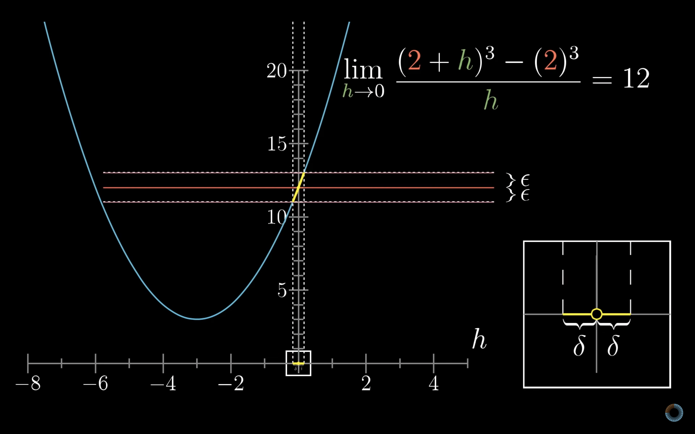
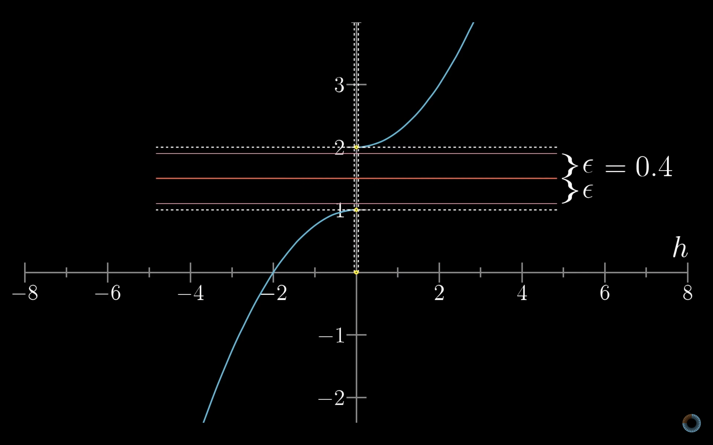

## Formal definition of derivatives

$$
{df \over dx}(2) = \lim_{h \to 0} = {{f(2 + h) - f(2)} \over h}
$$

## ($\epsilon$, $\delta$) definition of limits

## L'Hôpital's rule

$$
\lim_{x \to a}{f(x) \over g(x)} = {f'(a) \over g'(a)}
$$
