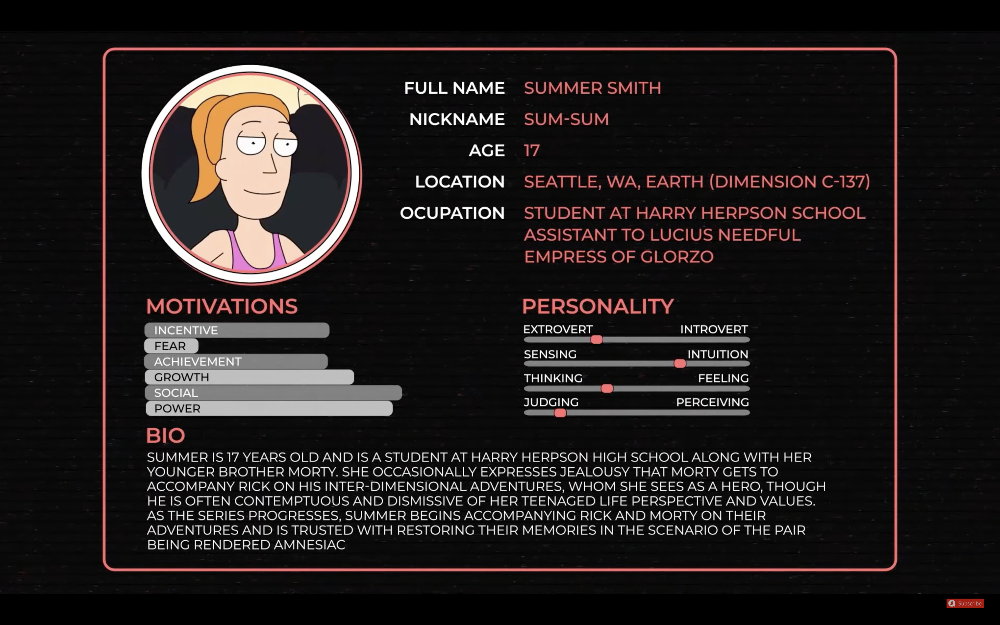
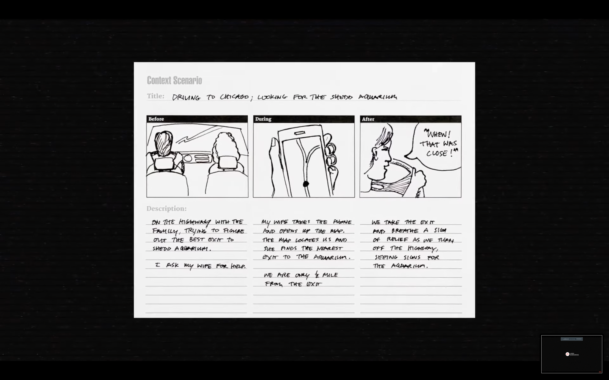
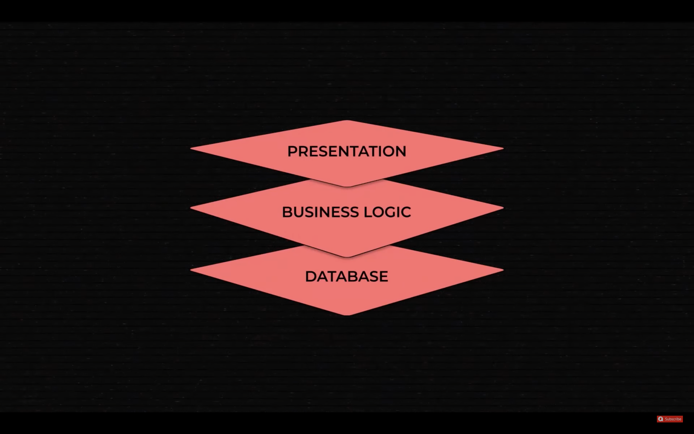
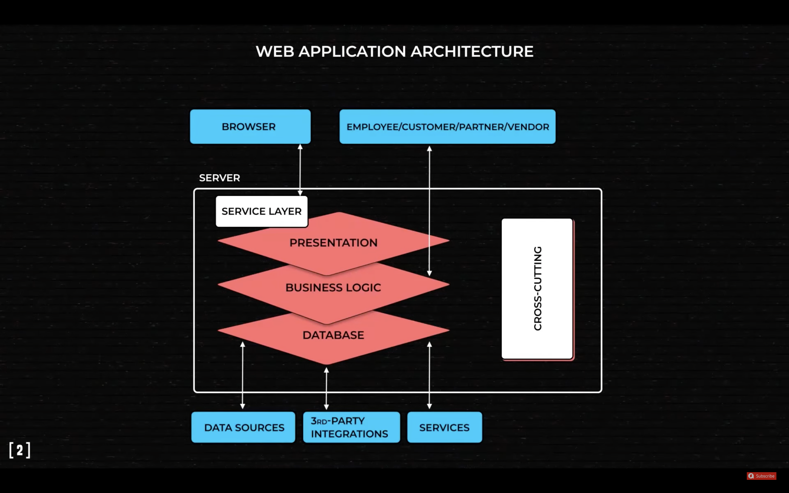

## Waterfall model and why not to use it

- Requirements Specification
  - Design
    - Implementation
      - Testing
        - Maintenance

Civil engineering approach for example: architecture and buildings

- Too rigid
- Does not abuse (utilize) the capabilities of digital software

## Agile

<https://agilemanifesto.org/>

1. Satisfy customers through early and continuous delivery of valuable software
   - Prioritize customers
   - Deliver early
   - Update continuously
2. Welcome changing requirements
3. Deliver working software frequently
4. Business people and developers must work together daily throughout the project.
5. Keep your team motivated. Trust them to get the job done.
6. Convey information in face-to-face conversation
7. Working software is the primary measure of progress
8. Create a workflow that can be maintained indefinitely
9. Continuous attention to technical excellence and good design enhances agility
10. Simplicity is essential
11. Your team should self-organize
12. Reflect at regular intervals, then tune and adjust accordingly

## Software planning

What documents are used in software planning?

Software planning ~~ Software documentation

## Project Documentation

### Product Documentation

What should the product be like?

#### Functional and non-functional requirements

A product is a system with a set of features which help users achieve their goals

**Features** are functional requirements
**Properties** of the system are non-functional requirements

Functional requirements | Non-Functional requirements
--- | ---
"A user should be able to check the order status on the main screen"  | A system must support 100,000 users at the same time
User capability | Describes the capabilities of the product

Requirements are dictated by users

#### User eXperience documentation

These help compile deliverables

- Prototypes
- Wireframes
- Journey maps

##### User persona

is a detailed description of a typical user.
These make it easier to visualize what people need, want and how they behave.

##### User scenarios

About people accomplishing a task

Understand users

##### User stories

Look similar to end features

Written from the point-of-view from a user persona

Examples:

- "As a busy manager, I want to receive automated reports so that I'm always up to date with metrics."
- "As a parent, I want to control what content my kids are watching to keep them safe."

#### Architecture design document

### Process documentation

How are we going to build it?
